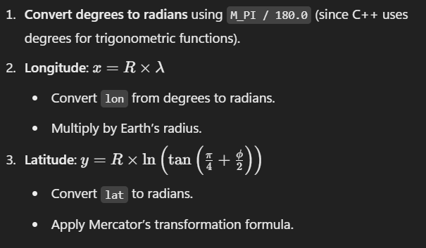

## TODO

- Load locally the database (Done)
- Take a paper and a pencil, by a,analysing the privious pratical work, draw how to mecanic of the project, in order to understand clearly the 
espectations. Then based on your understanding, design a step-by-step path I should follow in order to complete the project successfully. (Done)
- Create the MVC of Graph, SceneCarte (Done)
- Create the project's roadMap. (Done)
- Implement the Graph's class (Done)
- Find issues in the shortestPath algorithm (Done)
- Add comment to Graph class and to its methods (Done)
- Find solution to display distance
- Find solution to update the shortest path drawing at each go.
- Find solution for why shortest path does take in account waypoint which are not ville.

- Ressoudre bugs drawShortestPath()
- Recupérer le main
- 

- 
1. Create the relationship between waypoints based on the shortest distance between two.
`
waypointList = []
adjacencyList = {}
minDist = float("inf")
for A in waypointList:
    for B in waypointList:
        if A.getNom() != B.getNom():
           adjacencyList.get(A, [])

        currDist = getDistance(A, B)

        if currDist < minDist:
           neighbour = B
           minDist = currDist
    A.append(B)     
`

## Python Code to generate visuale Graph with relations
```py
import networkx as nx
import matplotlib.pyplot as plt

# Read edges from a text file
filename = "closestMapOutput.txt"

G = nx.Graph()
edges = []
with open(filename, "r") as file:
    for line in file:
        node1, node2 = map(str.strip, line.split(","))
        edges.append((node1, node2))

# Define edges based on input

# Create a graph
G = nx.Graph()
G.add_edges_from(edges)

# Draw the graph
plt.figure(figsize=(12, 9))
nx.draw(G, with_labels=True, node_color="lightblue", edge_color="black", node_size=80, font_size=0)
plt.show()
```

## Notes
In graph class, to convert the latitude and longitude into (x, y) coords, I will use the `Mercator projection`.



---

My first approch was implement a complete graph, which means all nodes are connected together. This graph representation give us the shortest path between A -> B is [A, B]. Because there is not checkpoint between both.
So deal with that and have the espected result!, I have to implement a sparse graph.
- A sparse graph is a type of graph in which the number of edges is significantly less than the maximum number of possible edges

- To implement a *sparse graph*, I have to change in my code the create adjacencyList(). By define connections between waypoints explicitly, or use some
criteria like (MaxDistance) to determine neighbors.
NB: *MaxDistance*: as a create criteria play a big role in path's *precision*. 
After testing, I find that the best value of the maxDistance is: 


## Issues
-  In the `getShorestestPath()` method, finding the shorestest path between two waypoints (src, dest) return the [src, dest] as the shortest.
The implemented algorithm is all corrects. But the problem is locate in the `createWeightedAdjacencyList()` methods. In the current algorithm, the 
weight are the distance between two waypoints. So when I execute the code, it return me [src, dest] as the shortest distance. 
To solve the issue and a list containing more than 2 waypoints, I have to correctly assign the weight.

This method create a fully connected Graph, making every location a direct neighbor of every other. This leads to direct connections being considered the 
shortest path, even when indirect path should be better.

To solve the issue, I will only closest neighbors instead of full connection.
I have to design an indirect graph.

```cpp
import networkx as nx
import matplotlib.pyplot as plt

def read_graph_from_file(filename):
    G = nx.Graph()  # Create an undirected graph
    with open(filename, 'r') as f:
        for line in f:
            # Strip any leading/trailing whitespace and split by commas
            nodes = line.strip().split(', ')
            if len(nodes) == 2:
                # Add an edge between two nodes
                G.add_edge(nodes[0], nodes[1])
    return G

def visualize_graph(G):
    # Draw the graph with a spring layout (you can use other layouts like circular, shell, etc.)
    plt.figure(figsize=(12, 12))
    nx.draw(G, with_labels=True, node_size=500, node_color='skyblue', font_size=4, font_weight='bold', edge_color='gray')
    plt.title("Graph Visualization")
    plt.show()

# Replace 'graph.txt' with the path to your graph file
filename = 'edgeList.txt'

# Read the graph from the file and visualize it
G = read_graph_from_file(filename)
visualize_graph(G)
```


## Thinking
Q: How to convert (lat, long) into (x, y) ?
R: By using the Mercator projection.

Q: How to get the neighbours of a waypoint knowing that their are not positionned horizontally or vertically or diagonally.
R: I can use bresenham algorithm.
Bresenham algorithm will be allow me to find a neighbour point by drawing a segment from the given waypoint to a waypoint in the map. If the segment exist, the first waypoint countered on the segment is a neighbour.

I can create add a functionnality on the choose the precision of the path.

# Short course about Graphs
```
### 1. **Weighted Graph**  
   - Each edge has a weight representing the **distance, time, or cost** to travel between two locations.
   - Used in **Google Maps, GPS systems, and transportation networks**.

### 2. **Directed Graph (Digraph) or Undirected Graph**
   - **Directed Graph:** If roads are **one-way streets**, edges have a direction.
   - **Undirected Graph:** If roads allow travel in both directions, edges are bidirectional.

### 3. **Sparse or Dense Graph**
   - **Sparse Graph:** If there are only a few direct connections (e.g., rural areas).
   - **Dense Graph:** If most locations are connected (e.g., urban cities).

### 4. **Graph Algorithms for Shortest Path**
   - **Dijkstra’s Algorithm** → Best for **finding the shortest path with positive weights**.
   - **A* (A-Star) Algorithm** → Uses heuristics for **faster pathfinding**.
   - **Bellman-Ford Algorithm** → Handles **negative weights** but slower.
```

# About the Graph class
- `findShortestPath()` : return to me a list of in representing indeces of a waypoints.
- Do be able to visualize a graph, I implement the `adjacencyList` into `edgeList` and store the output in a .txt file, which will be used in a python code to visualize the graph.


Création du Graphe:

Vous créez le graphe avec une precision de 53 kilomètres. Cela signifie que deux points de cheminement sont considérés comme voisins s'ils sont à moins de 53 km l'un de l'autre en distance à vol d'oiseau (calculée par la formule de Haversine).
C'est là que réside le problème : vous utilisez la distance à vol d'oiseau pour construire le graphe, ce qui ne reflète pas les distances routières réelles.
Algorithme de Dijkstra:

Vous utilisez correctement l'algorithme de Dijkstra pour trouver le chemin le plus court dans le graphe.
Cependant, le chemin trouvé est basé sur les distances à vol d'oiseau, ce qui donne un résultat incorrect pour les routes.

Si tu posais la question de savoir comment poids sont définis dans un graph, Pour un graph représenter par les points, les poids sont définis par la distance entre deux points.
Dans le cas de google map, pour nous donner le chemin le plus court, dépendament du traffic route, les poids sont multiplier par des modificateurs de poids appellés facteurs multiplicateurs.
Si à un point D il y'a un soucis (construction), le poids associé au points D sera multiplier par un facteur afin l'algorithm du calcul du chemin le plus court ne passe par là.

--- Propositions d'amélioration du code ---
- Varier la précision en fonction de la distance. Distance_court (10 - 20 km) distance_long (50 - 100 km) en utlisant l'algorithme
- fonction qui calcule la précision optimale en fonction de la distance à vol d'oiseau entre les points. Par exemple, une fonction linéaire ou logarithmique qui augmente la précision avec la distance.
- 

1. Ajustement de la Précision Dynamique

Varier la précision en fonction de la distance:
Pour les distances courtes, une précision plus élevée (par exemple, 10-20 km) peut donner de meilleurs résultats, car les routes ont tendance à être plus directes.
Pour les distances longues, une précision plus faible (par exemple, 50-100 km) peut être nécessaire pour éviter de créer un graphe trop dense avec des connexions irréalistes.
Utiliser une fonction de précision adaptative:
Vous pourriez créer une fonction qui calcule la précision optimale en fonction de la distance à vol d'oiseau entre les points. Par exemple, une fonction linéaire ou logarithmique qui augmente la précision avec la distance.
2. Pondération des Arêtes du Graphe

Facteurs de correction:
Au lieu d'utiliser directement la distance à vol d'oiseau comme poids des arêtes, vous pouvez appliquer des facteurs de correction.
Par exemple, vous pourriez multiplier la distance à vol d'oiseau par un facteur qui tient compte de la densité du réseau routier dans la région.
Données géographiques supplémentaires:
Si vous avez des données sur les types de routes (autoroutes, routes nationales, etc.), vous pouvez les utiliser pour pondérer les arêtes.
Par exemple, vous pourriez donner un poids plus faible aux arêtes qui correspondent à des autoroutes.
3. Amélioration de la Création du Graphe

Triangulation de Delaunay ou graphes de Voronoï:
Ces techniques permettent de créer des graphes qui reflètent mieux la structure du réseau routier.
La triangulation de Delaunay connecte les points de manière à minimiser les angles des triangles, ce qui peut donner des résultats plus réalistes.
Les graphes de Voronoï créent des régions autour de chaque point, et les arêtes connectent les points dont les régions sont adjacentes.
Élimination des arêtes irréalistes:
Après avoir créé le graphe, vous pouvez analyser les arêtes et supprimer celles qui sont clairement irréalistes.
Par exemple, vous pourriez supprimer les arêtes qui traversent des obstacles naturels (montagnes, lacs) ou qui sont trop longues pour être des routes.
4. Post-traitement du Chemin Trouvé

Lissage du chemin:
Le chemin trouvé par l'algorithme de Dijkstra peut contenir des segments anguleux. Vous pouvez appliquer des techniques de lissage pour rendre le chemin plus réaliste.
Par exemple, vous pouvez utiliser des splines cubiques ou des algorithmes de lissage de courbes.
Ajout de points intermédiaires:
Si vous avez des données sur les routes principales, vous pouvez ajouter des points intermédiaires au chemin trouvé pour le rendre plus précis.
Limites

Même avec ces améliorations, il est impossible d'obtenir une précision parfaite de la distance routière sans utiliser une API de routage.
Les calculs à vol d'oiseau ne tiennent pas compte des contraintes du réseau routier (sens uniques, virages interdits, etc.).